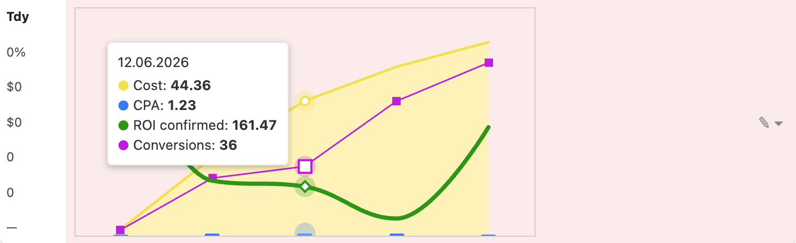
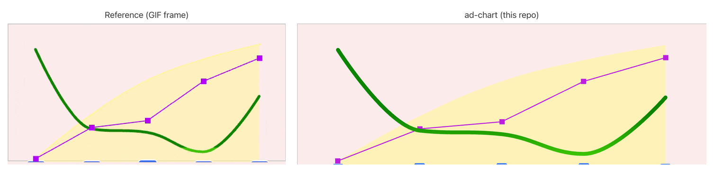

# ad-chart

A small, framework-agnostic **combined time-series chart** — area + columns + spline + line on four
hidden axes, with a shared hover tooltip. Built on Highcharts, shipped as a tiny vanilla API plus a
React wrapper.

[](https://github.com/kotbarbarossa/ad-chart/actions/workflows/ci.yml)
[](https://kotbarbarossa.github.io/ad-chart/)
[](./LICENSE)

<p align="center">
  
</p>

## Live demo

**https://kotbarbarossa.github.io/ad-chart/** — hover the chart to see the shared tooltip, halos and
per-series markers. A “Randomize data” button and a Vanilla / React toggle show the live API.

## Reference vs implementation

The look and hover behaviour were reproduced from a reference recording. Colours were eyedropped from
extracted frames and the per-series axis headroom was measured from where each series lands in the plot.

<p align="center">
  
</p>

## Quick start

```bash
pnpm install
pnpm dev          # open the printed localhost URL
```

Requires Node.js 22+ and pnpm (via Corepack: `corepack enable pnpm`).

## Usage: initialize with four series

### Vanilla (main API)

```ts
import { createAdChart } from 'ad-chart';

const chart = createAdChart('#chart', {
  cost:         [['2026-06-10', 2.04],   ['2026-06-11', 25.85], ['2026-06-12', 44.36],  ['2026-06-13', 55.65], ['2026-06-14', 63.75]],
  cpa:          [['2026-06-10', 0.68],   ['2026-06-11', 0.86],  ['2026-06-12', 1.23],   ['2026-06-13', 0.79],  ['2026-06-14', 0.71]],
  roiConfirmed: [['2026-06-10', 610.78], ['2026-06-11', 180.5], ['2026-06-12', 161.47], ['2026-06-13', 56.33], ['2026-06-14', 357.25]],
  conversions:  [['2026-06-10', 3],      ['2026-06-11', 30],    ['2026-06-12', 36],     ['2026-06-13', 70],    ['2026-06-14', 90]],
}, {
  height: 220, // optional
});

chart.update(newData); // re-render with new data
chart.destroy();       // remove listeners and destroy the instance
```

`createAdChart(container, data, options?)` — `container` is an `HTMLElement` or a CSS selector.

### React

```tsx
import { AdChart } from 'ad-chart/react';

<AdChart data={data} height={220} />;
```

### Without a build step (CDN)

Serve `dist/` (or the built demo) and load Highcharts + Zod from a CDN with an import map:

```html
<div id="chart" style="height: 220px"></div>
<script type="importmap">
  {
    "imports": {
      "highcharts": "https://esm.sh/highcharts@13",
      "zod": "https://esm.sh/zod@4",
      "ad-chart": "./dist/index.js"
    }
  }
</script>
<script type="module">
  import { createAdChart } from 'ad-chart';
  createAdChart('#chart', {
    cost:         [['2026-06-10', 2.04], ['2026-06-14', 63.75]],
    cpa:          [['2026-06-10', 0.68], ['2026-06-14', 0.71]],
    roiConfirmed: [['2026-06-10', 610.78], ['2026-06-14', 357.25]],
    conversions:  [['2026-06-10', 3], ['2026-06-14', 90]],
  });
</script>
```

## Data format

```ts
type TimePoint =
  | [time: number | string, value: number | null] // tuple
  | { date: string | number | Date; value: number | null }; // object

interface AdChartData {
  cost: TimePoint[];         // area
  cpa: TimePoint[];          // columns
  roiConfirmed: TimePoint[]; // spline
  conversions: TimePoint[];  // line
}
```

- **Times** may be epoch milliseconds, an ISO string, or a `Date`. A date-only string (`YYYY-MM-DD`) is
  treated as a **UTC** calendar day, so `2026-06-12` never slips to the 11th in a negative-offset zone.
- **Series may differ in length and have gaps.** All dates are merged, sorted and aligned; a missing
  point becomes `null` (a line break / no column) and is omitted from the tooltip.
- **Duplicate dates** in one series keep the last value (with a dev-mode warning).
- **Invalid input** (`NaN`, non-numeric, empty series, unparseable date) throws a Zod error that names the
  series and index, e.g. `cost[2].value must be a finite number`.

## Options

| Option         | Type                              | Default        | Description                                             |
| -------------- | --------------------------------- | -------------- | ------------------------------------------------------- |
| `height`       | `number`                          | `220`          | Chart height in px; width is fluid to the container.    |
| `labels`       | `Partial<Record<SeriesKey, str>>` | English names  | Tooltip labels per series (i18n).                       |
| `colors`       | `Partial<Record<SeriesKey, str>>` | measured hues  | Series colour overrides.                                |
| `axisHeadroom` | `Partial<Record<SeriesKey, num>>` | measured ratios| Hidden-axis max = `dataMax * headroom` (axis min is 0). |

`SeriesKey` is `'cost' | 'cpa' | 'roiConfirmed' | 'conversions'`.

## API

`createAdChart` returns an instance:

| Member       | Description                                                      |
| ------------ | -------------------------------------------------------------- |
| `update(data)` | Validate, re-normalize and re-render with new data.          |
| `destroy()`    | Disconnect the `ResizeObserver` and destroy the Highcharts instance. |
| `highcharts`   | The underlying Highcharts `Chart`, for advanced use.        |

The chart follows its container's size via a `ResizeObserver`.

## Scripts

| Script              | What it does                                        |
| ------------------- | --------------------------------------------------- |
| `pnpm dev`          | Run the demo dev server.                            |
| `pnpm build`        | Build the library (ESM + type declarations).        |
| `pnpm build:demo`   | Build the demo for GitHub Pages.                    |
| `pnpm test`         | Unit tests (Vitest).                                |
| `pnpm coverage`     | Unit tests with coverage (≥ 90 % on `core/`).       |
| `pnpm test:e2e`     | End-to-end tests (Playwright).                      |
| `pnpm lint`         | Lint + format check (Biome).                        |
| `pnpm typecheck`    | `tsc --noEmit`.                                     |
| `pnpm extract-frames` | Extract reference GIF frames into `docs/frames/`. |

## Tech stack

- **Node.js 22** + **pnpm** (Corepack, pinned via `packageManager`).
- **TypeScript** with `strict`, `noUncheckedIndexedAccess`, `exactOptionalPropertyTypes`.
- **Vite** — library mode (ESM + `vite-plugin-dts`) and the demo app.
- **Highcharts** for rendering (halo, circle/diamond/square markers, shared tooltip).
- **React 19** wrapper via a separate `ad-chart/react` entry.
- **Zod** for input validation with readable errors.
- **Biome** for lint + format; **lefthook** pre-commit hooks.
- **Vitest** for unit tests; **Playwright** for e2e and screenshot tests.
- **GitHub Actions** for CI and GitHub Pages deployment.

## Project structure

```
src/
  index.ts            # public API: createAdChart, types
  react.tsx           # AdChart React component
  highcharts.ts       # the only place Highcharts is imported
  core/
    schema.ts         # Zod validation
    normalize.ts      # align series by date, nulls, UTC
    build-options.ts  # PURE: data + options -> Highcharts.Options
    tooltip.ts        # PURE tooltip renderer
    theme.ts          # colours, sizes, axis headroom defaults
    format.ts         # number / date formatting
demo/                 # demo page (vanilla + React toggle)
tests/{unit,e2e}/     # Vitest and Playwright tests
scripts/              # extract-frames.ts
docs/                 # reference.gif, comparison.png, demo.png
```

All logic lives as pure functions in `core/`; Highcharts and the DOM are only touched at the edge
(`index.ts`, `react.tsx`), so the chart definition is easy to test and the vendor is easy to swap.

## Notes

- **Highcharts licensing.** Highcharts is free for non-commercial / personal use; commercial use needs a
  licence — see [highcharts.com](https://www.highcharts.com/). The vendor is isolated behind
  `buildChartOptions` and `src/highcharts.ts`, so it can be replaced without touching the core. This
  repository's own code is MIT.
- **How the styles were derived.** `pnpm extract-frames` renders the reference GIF to PNGs; colours were
  eyedropped from the tooltip legend dots and stroke centres, and axis headroom was computed from each
  series' extreme point. Final values live in `src/core/theme.ts` and are all overridable.
```
